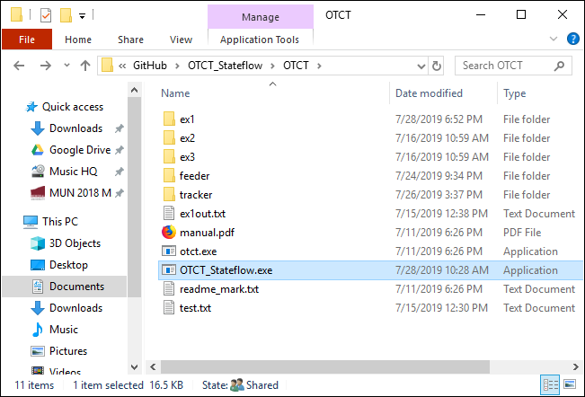
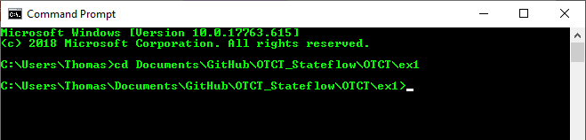
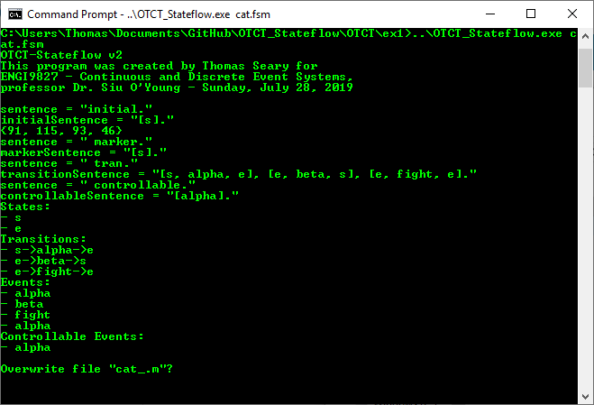
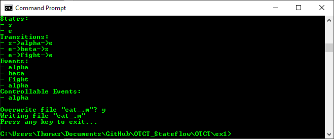
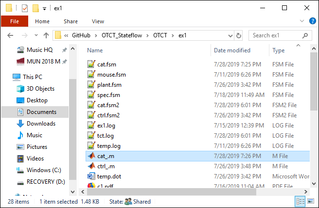
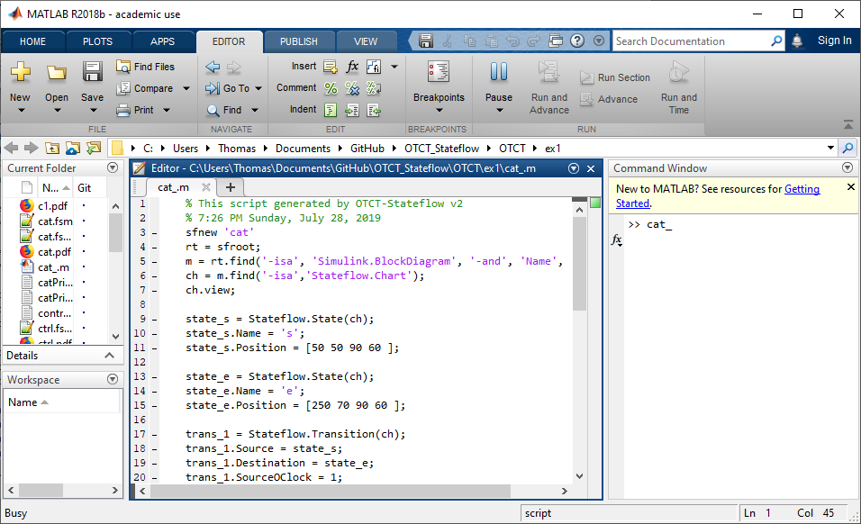
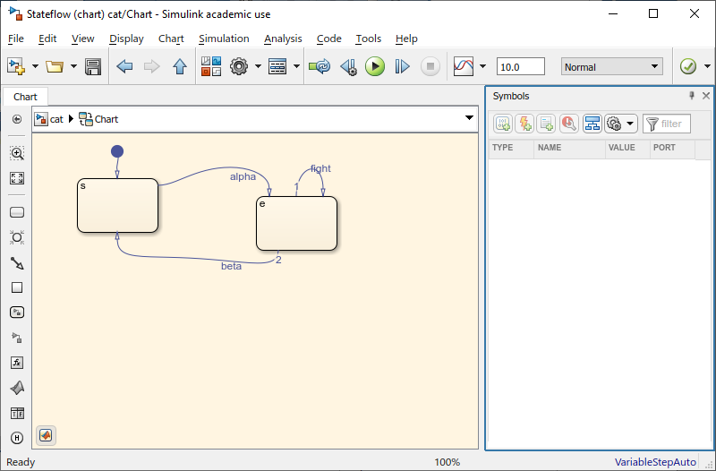

# OTCT_Stateflow
Convert file formats between OTCT and Simulink Stateflow.

## How to Use OTCT_Stateflow
### Convert an OTCT State Machine to a Simulink Stateflow Chart
1. Copy OTCT_Stateflow/bin/Release/OTCT_Stateflow.exe to your OTCT folder. e.g. C:\\documents\\OTCT\\\


2. Open cmd and navigate to your OTCT project directory, e.g. cd C:\\documents\\OTCT\\ex1\\\


3. Run the command "..\OTCT_Stateflow.exe cat.fsm", where cat.fsm is an OTCT text file. If prompted, press Y to overwrite the existing file.\
\


4. A MATLAB script cat_.m will be produced in the OTCT project directory.\


5. Open MATLAB and run the script cat_.m to produce a new Simulink model containing the state machine.
The Simulink model will be automatically saved as cat.mdl.\
\


## .fsm and .fsm2 Files
Both .fsm and .fsm2 are plaintext files describing OTCT state machines. Files created by hand should use the .fsm extension. Files created with the OTCT printbyname() function should use the .fsm2 extension. Hand-typed files and printbyname()-generated files use slightly different syntax, hence the need for different extensions.\
If an extension other than this is used (such as .txt), it is treated the same as .fsm.

## Example: Sync two state machines with OTCT, then convert the result into Stateflow.
Suppose we have two state machines, "cat.fsm" and "mouse.fsm" in the folder OTCT\\ex1\\. We want to find the synchronous product of these using OTCT. Assume that otct.exe and OTCT_Stateflow.exe are located in the folder OTCT\\.

**cat.fsm**
```
initial.
[s].

marker.
[s].

tran.
[s, alpha, e], [e, beta, s], [e, fight, e].

controllable.
[alpha].
```

**mouse.fsm**
```
initial.
[s].

marker.
[s].

tran.
[s, gamma, e], [e, delta, s], [e, fight, e].

controllable.
[gamma].
```
We use the following OTCT batch file to construct the synchronous product of these two (printAsPDF is optional):

**run.txt**
```
cat = fsm(cat.fsm)
mouse = fsm(mouse.fsm)
plant = sync(cat,mouse)
printAsPDF(plant,plant.pdf)
printByName(plant,plant.fsm2)
```
In Windows command prompt, navigate to OTCT\\ex1\\, then run:
```
..\otct.exe run.txt
```
The resulting file "plant.fsm2" will be parsed with OTCT_Stateflow to produce a MATLAB script. Note the file extension .fsm2 used with the printByName() function. This is important for OTCT-Stateflow to parse the file correctly.

**plant.fsm2**
```
plant    # states: 4

initial state: [s,s]

marker states:
[s,s]

# transitions: 9

transition table:
[[e,e], beta, [s,e]]
[[e,e], delta, [e,s]]
[[e,e], fight, [e,e]]
[[e,s], beta, [s,s]]
[[e,s], gamma, [e,e]]
[[s,e], alpha, [e,e]]
[[s,e], delta, [s,s]]
[[s,s], alpha, [e,s]]
[[s,s], gamma, [s,e]]

plant printed.
```
In Windows command prompt, run this command:
```
..\OTCT_Stateflow.exe plant.fsm2
```
This will produce a MATLAB script plant_.m in the folder OTCT\\ex1\\. Run the script in MATLAB to generate a Stateflow chart of the plant.
